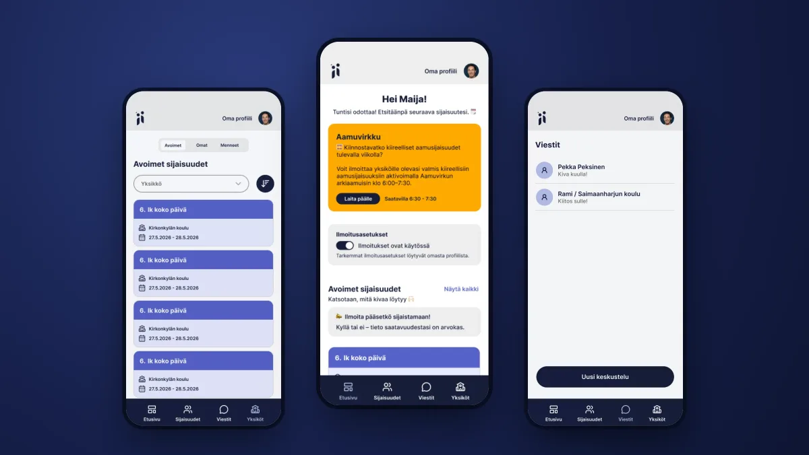
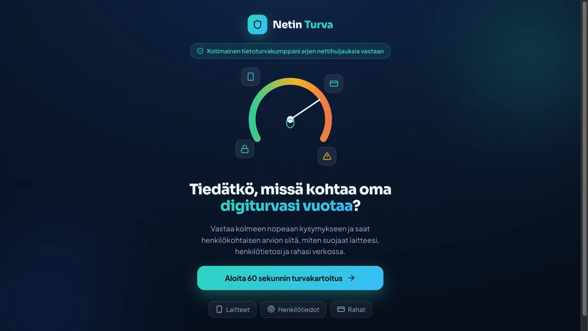
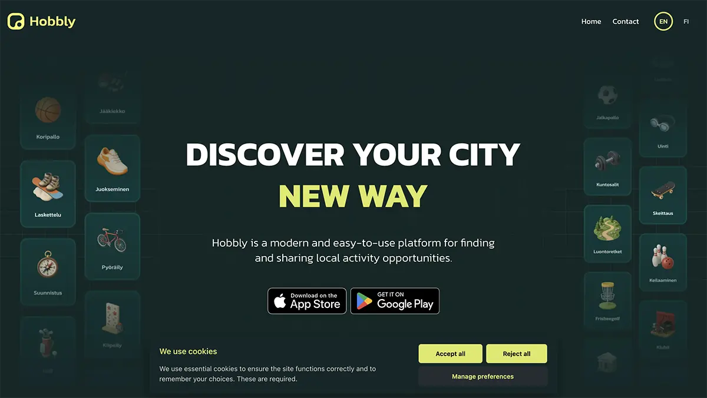

    
    
    
    
    
    

## 🙋 About me

I have 6+ years of experience in software development and web design. 
I hold a BBA in Business Information Technology and a degree in full-stack programming. 
I am currently working as a software engineer at One Lion Company.

- 🚀 I engineer products end to end — mobile apps, APIs, databases and cloud infrastructure
- 🤖 I build with AI-driven workflows: Claude, MCP servers, CI/CD and automation
- ☸️ I am great with software architecture, Kubernetes deployments and hosting
- 🌀 I am confident in leading Scrum and Agile projects
- 🎨 I am experienced in designing websites and CMS

## 🎮 Beyond the code

- 🤝 I love networking, meet-up events and hackathons. I am a frequent goer of HelsinkiJS, Junction, Slush, Drupal events and coding club.
- 🔭 I am passionate about everything related to technology e.g computer science, space, and machine learning.
- 🕹️ I love gaming. I play a lot of games in many different platforms. I can also build and mod gaming PCs.

## 🛠️ Tech stack

#### 🤖 AI engineering

    
    
    
    
    

#### 💻 Languages & frameworks

    
    
    
    
    
    
    
    
    
    
    
    
    

#### 🗄️ APIs & databases

    
    
    
    
    
    

#### ☁️ Cloud & DevOps

    
    
    
    
    
    
    
    
    

#### ✅ Testing & quality

    
    
    
    

#### 🎨 Front end & design

    
    
    
    
    
    
    
    

## 🚀 Featured projects

<table>
    <tr>
        <td align="center" width="33%">
            
             <b>Sijaismestari</b> 
            Substitute staffing platform for Finnish education — matching qualified workers with open shifts 
            <code>React Native</code> <code>Expo</code> <code>Django</code> 
            <a href="https://www.sijaismestari.fi/">Website</a> ·
            <a href="https://apps.apple.com/fi/app/sijaismestari/id6784601798">App Store</a> ·
            <a href="https://play.google.com/store/apps/details?id=com.nonitech.sijaismestari">Google Play</a>
        </td>
        <td align="center" width="33%">
            
             <b>Netin Turva</b> 
            Interactive digital security assessment and webstore for cybersecurity subscriptions 
            <code>Next.js</code> <code>Tailwind</code> <code>PostgreSQL</code> 
            <a href="https://www.netinturva.fi/">Website</a>
        </td>
        <td align="center" width="33%">
            
             <b>Hobbly</b> 
            Local activities platform — from idea to the app stores 
            <code>React Native</code> <code>Laravel</code> <code>AWS</code> 
            <a href="https://hobbly.app/">Website</a> ·
            <a href="https://apps.apple.com/us/app/hobbly/id6746831794">App Store</a> ·
            <a href="https://play.google.com/store/apps/details?id=com.hobbly.app">Google Play</a>
        </td>
    </tr>
</table>

See more of my work at <a href="https://alextran.dev/projects"><b>alextran.dev/projects</b></a>

## 📊 GitHub stats

    
    
    

## 🐍 Contributions

<picture>
  <source media="(prefers-color-scheme: dark)" srcset="https://raw.githubusercontent.com/alextrandev/alextrandev/output/github-contribution-grid-snake-dark.svg" />
  <source media="(prefers-color-scheme: light)" srcset="https://raw.githubusercontent.com/alextrandev/alextrandev/output/github-contribution-grid-snake.svg" />
  
</picture>

    <i>Thanks for stopping by — let's build something together!</i> ⚡ 
    <a href="https://alextran.dev/contact"><b>Get in touch →</b></a>

